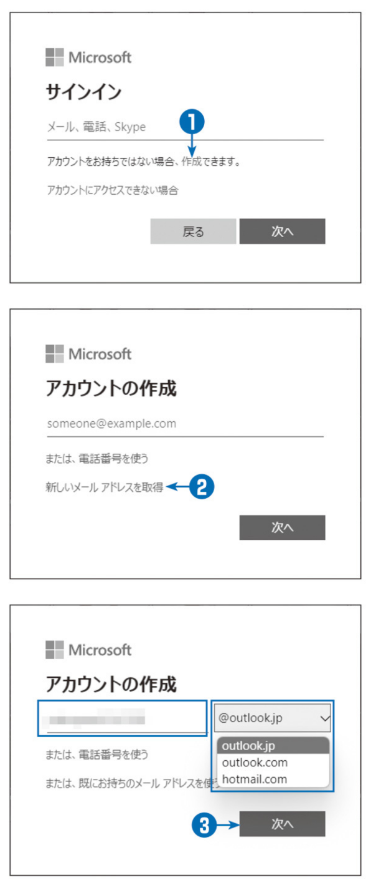

# 第1章 Azureの概要
### リンク集
p.2
The NIST Definition of Cloud Computing」
[http://nvlpubs.nist.gov/nistpubs/Legacy/SP/nistspecialpublication800-145.pdf](http://nvlpubs.nist.gov/nistpubs/Legacy/SP/nistspecialpublication800-145.pdf)

p.3
「NISTによるクラウドコンピューティングの定義」
[https://www.ipa.go.jp/files/000025366.pdf](https://www.ipa.go.jp/files/000025366.pdf)

p.9
契約後、30日間利用可能な200ドル相当のクレジットが割り当てられます (ただし、1人につき1回限り)。 一部のサービスは引き続き最大1年間無料で利用できますが、それには従量課金に移行する必要があります (図1-4)。 また、常に無料で提供されるサービスも存在します。詳しくは以下の Web サイトを参照してください。
[https://azure.microsoft.com/ja-jp/free/](https://azure.microsoft.com/ja-jp/free/)

p.23
「Microsoft アカウントと組織アカウントについて」
[https://learn.microsoft.com/ja-jp/archive/blogs/dsazurejp/](https://learn.microsoft.com/ja-jp/archive/blogs/dsazurejp/)

p.27
「Azure サブスクリプションとサービスの制限、 クォータ、 制約」
[https://learn.microsoft.com/ja-jp/azure/azure-resource-manager/management/azure-subscription-service-limits](https://learn.microsoft.com/ja-jp/azure/azure-resource-manager/management/azure-subscription-service-limits)

## 1-3-1 実習
契約の時点でクレジットカードが必要ですが、 利用者が明示的に従量課金に移行しない限り課金が自動的に行われることはありません。 念のため、 評価期間の終了前後には課金対象となっているサービスの利用状況を確認することをお勧めしますが、 勝手に課金されることはないので安心してください。
以下に示すのは本書の執筆時点での手順です。


```
①
---
Azure の無料アカウントのサインアップ用URL[https://signup.azure.com/](https://signup.azure.com/) にアクセスする。 アカウントの選択画面が表示された場合は、 適切なアカウントを選択するか、 [別のアカウントを使用する] を選択して、サインイン画面に進む。
- アカウントの選択画面は表示されない場合もある。
- 既に Microsoftアカウントまたは Azure ADアカウントでサインインしている場合は、ユーザー名とパスワード入力を求められず自動的にサインインする場合がある。

②
---
[サインイン] 画面で、 Microsoft アカウントのユーザー名 (メールアドレス) を入力して [次へ] をクリックする。
- Microsoft アカウントをまだ取得していない場合、 この画面の [アカウントをお持ちでない場合、作成できます] の [作成] リンクをクリックするとMicrosoft アカウントを作成できる。 詳しくは次項 「Microsoft アカウントのサインアップ」を参照。

③
---
[パスワードの入力] 画面で、パスワードを入力して[サインイン] をクリックする。

④
---
[サインインの状態を維持しますか?] 画面で、[はい] をクリックする。これにより設定情報が保存されるため、再サインインの回数を減らせる。 共用PCを使っている場合はセキュリティリスクとなるので [いいえ] を選択する。
⑤
---
[プロフィール(自分の情報)] として、以下の項目を入力する。 姓名の順序に注意すること。
- 国/地域
- 名
- ミドルネーム (省略可能)
- 姓
- 電子メールアドレス (Microsoft アカウントのメールアドレスと別でもよい)
- 電話番号

- 電話番号は、個人情報として記録するほか、 ショートメッセージ(SMS) を送信して身元確認に使用する。 身元確認用に別の電話を使いたい場合は [別の電話番号を使用してお客様のIDを確認します]をオンにすると、 別の番号を指定できる。

⑥
---
[テキストメッセージを送信する] をクリックして、SMSを受信する。 または、 [電話する] をクリックして音声応答システムで確認コードを受け取ることも可能。
⑦
---
SMSで送られてきた確認コードを [確認コード]ボックスに入力して [コードの確認] をクリックする。

⑧
---
コードの確認が完了したらスクロールダウンして、追加のプロフィール情報を入力する。
- 名の読み方
- 姓の読み方
- 郵便番号
- 都道府県
- 市区町村
- 住所
- 建物名、部屋番号 (省略可)
⑨
---
[顧客契約とプライバシーに関する同意に同意します] をオンにして、[次へ] をクリックする。 Azureに関するニュースレターやマイクロソフトのパートナー製品などの情報提供に同意する場合は、 その下の2つのチェックボックスもオンにする。
⑩
---
クレジットカードに関する情報を入力し、[サインアップ] をクリックする。
  

⑪
---
サインアップの処理が開始されるので、 終わるまで待つ。 待っている間に、ここまでの作業についての意見を書いて送信することもできる。 特になければ何もせず待てばよい。 ここで、 無料試用版が使えない場合は、 従量課金の契約画面に移行するので、 必要事項に答えて無料試用なしの従量課金契約を行う。

⑫
---
以上で契約が完了し、 自動的に Azure の管理画面(Azure ポータル) に移行する。
```


## 1-3-2 実習
Microsoft アカウントは、 Azure を含めマイクロソフトが提供する大半のサービスで必要なIDで、任意の電子メールアドレスに対して登録できます。 OneDrive やoutlook.comなどを使っている場合は自動的に Microsoft アカウントとして登録されるので、 それを使ってください。 Windows 8以降を使っている場合は、OSの初期設定時にMicrosoft アカウントを作成しているかもしれません。 「既に登録されている」 というエラーが表示された場合で、普段Windows にメールアドレスでサインインしているならば、OSのサインイン情報を使ってAzureにサインインしてみてください。Microsoft アカウントを持っていない場合、 Azure ポータルのサインイン画面でエラーが起きます。 このとき、[アカウントをお持ちでない場合、 作成できます] の [作成] をクリックすると、 Microsoftアカウントを作成できます。ここでは、 新しいメールアドレスを取得して Microsoft アカウントを作成する手順を説明します。 手持ちのメールアドレスを使って Microsoft アカウントを作成する手順は、次項で説明します。なお、 Microsoft アカウントを取得するための画面は頻繁に変わるので、参考程度にご覧ください。 ただし、 基本的な流れは今後も変わらないと思われます。Microsoft アカウントの代わりにAzure AD (Azure Active Directory) のユーザーアカウントを使うこともできます。 会社の業務で Azure を利用する場合で、 既に Azure AD が導入されているときは、 必ず Azure AD のユーザーアカウントを使ってください。 たとえば法人向け Microsoft 365の契約をしている場合は Azure AD を使っているはずです。

```
①
---
Microsoft アカウントのサインイン画面で [アカウントをお持ちでない場合、 作成できます] の [作成]リンクをクリックする。
②
---
[アカウントの作成] 画面で、 [新しいメールアドレスを取得] をクリックする。
- [新しいメールアドレスを取得] をクリックすると、無料のメールアドレスとともに Microsoft アカウントを作成できる。 手持ちのメールアドレスを使いたい場合は、 有効なメールアドレスを指定して [次へ] をクリックする (次項を参照)。

③
---
ほかと重複しない任意の名前とドメイン名を指定して [次へ] をクリックする。 ドメイン名は outlook.jp、 outlook.com、 hotmail.comの中から選択できる。


④
---
[パスワードの作成] 画面で、 次回からのサインインに使うパスワードを指定して [次へ] をクリックする。

⑤
---
[アカウントの作成] 画面で [次へ] をクリックする。


⑥
---
クイズを読んで解答画像をクリックする

⑦
---
Microsoft アカウントが作成される。

```



## 1-3-3 実習
手持ちのメールアドレスでMicrosoft アカウントを作成する手順は以下の通りです

```
①
---
Microsoft アカウントのサインイン画面で [アカウントをお持ちでない場合、 作成できます] の [作成]リンクをクリックする。

②
---
[アカウントの作成] 画面で、 有効なメールアドレスを指定して [次へ] をクリックする。

③
---
[パスワードの作成] 画面で、次回からのサインインに使うパスワードを指定して [次へ] をクリックする。


④
---
指定したメールアドレスにコードが送られてくるので、 [メールの確認] 画面にそれを入力して [次へ]をクリックする。 マイクロソフトからのキャンペーンメールを受け取るかどうかは任意。
- これ以降は、 

```


## 1-3-4 実習
現在の課金状況は以下の手順で調べることができます。

```
①
---
Azure ポータルで画面左上のポータルメニューボタン(通称「ハンバーガーボタン」) をクリックする。

②
---
[すべてのサービス] をクリックする。

③
---
[すべて] から [サブスクリプション] を選択する。

④
---
利用権限のあるサブスクリプションがすべて表示されるので、現在のコストを調べる。 サブスクリプションのリンクをクリックすると、 さらに詳細な情報を表示できる。
```


## 4 管理ツールとデプロイモデル
Azure の仮想マシンを管理するために覚えておかなければならないのが、 管理ツールとデプロイモデル(展開
モデル)です。
### Azure ポータル (Azure 管理Webサイト)
Azure の管理サイト (https://portal.azure.com) を 「管理ポータル」 または 「Azure ポータル」と呼びます。
Azure ポータルの特徴は、以下の通りです。
- **開始画面のカスタマイズ**･･･ よく使う機能を 「ダッシュボード」 として登録できます。 また、 機能が固定された「ホーム」を選択することもできます。 現在の既定値は「ホーム」です。
- **リッチな操作体験**･･･ Webアプリケーションですが、 右クリックを含め一般的なWindows アプリケーションのように利用できます。
- **クラウドシェルの利用**・・・ Azure ポータルからLinuxシェル (bash) またはPowerShell を起動し、コマンドラインツールを使った管理が可能です。

### Azure ポータルの基本的な使い方 初期画面
Azure ポータルを利用するにはhttps://portal.azure.com にアクセスし、 Azureのサブスクリプション契約を行ったMicrosoft アカウント (または Azure ADのアカウント) でサインインします。Azure ポータルは、 通常のWindows アプリケーションと同様、 右クリックで多くの操作が可能です (後述のヒント 「Azure ポータルの右クリック」を参照)。また、仮想マシンを含むAzure の状態はほぼリアルタイムに画面に反映されるため、その都度再表示する必要はありません。 ただし、 自動更新が適切に動作しない場合もあるので、必要に応じて再表示してください。Azure ポータルの初期画面は「ホーム」 と 「ダッシュボード」のいずれかを選択できます (図1-9)。 「ホーム」 は基本的な機能が並んだ固定的な画面で、 「ダッシュボード」はカスタマイズ可能な画面です。

ホームとダッシュボードは、 ポータルメニューからいつでも切り替えることができます。
①
---
Azure ポータルで画面左上のポータルメニューボタン(通称「ハンバーガーボタン」) をクリックする。

②
---
[ホーム] または [ダッシュボード] をクリックして、表示を切り替える。

初期画面の既定値を変更する手順は以下の通りです。

①
---
Azure ポータルで [設定] ボタン (歯車のアイコン)をクリックする。

②
---
[外観とスタートアップビュー] をクリックし、[スタートアップ表示] で [ホーム] または [ダッシュ
ボード] を選択する。

③
---
[適用] をクリックする。

### Azure ポータルの基本的な使い方: リソース作成
新しいリソースを作成する場合は、 ウィンドウ内左上の[+リソースの作成] をクリックするか、 ポータルメニューの[+リソースの作成] をクリックします。 このとき開くサブウィンドウを 「ブレード」 と呼びます。最初に表示されるブレードには、リソースのカテゴリ分類のほか、 人気のあるサービスの種別 (たとえば 「仮想マシン」や「ストレージアカウント」) や人気のある Marketplace 製品 (たとえば 「Windows Server 2019」や「Ubuntu Server 20.04 LTS」) が並びます (図1-10)。 Marketplace 製品は、 サードパーティ提供のサービスを含めた Azure の具体的なリソースを意味します。作成したいリソースの種別を選択すると、 必要に応じてさらに細かな設定に進んでいきます。

>ヒント:ポータルメニュー
>-
>Azure ポータルの左上にある [=] ボタンを 「ポータルメニューボタン」 と呼びます (右の画面)。 また、 [≡ ]をクリックして表示されるメニューを 「ポータルメニュー」 と呼びます。 ちなみに、 [=] ボタンは「ハンバーガーボタン」 と俗に呼ばれますが、 本来は 「引き出し」を意味するアイコンです。

>目的のリソースが表示されないときは
>-
>目的のリソースが表示されないときは、 検索ボックスで以下のいずれかをキーボード入力して検索し、それぞれのリソース管理画面から [+追加] ボタンをクリックしてください。
>- 英語リソース名の先頭文字列 (たとえば 「virtu」 まで入力すると 「Virtual Networks」 や 「Virtual Machines」 などが表示される)
>- 日本語リソース名の先頭文字列 (たとえば 「仮想」 と入力すると 「仮想ネットワークゲートウェイ」 などが表示される)
>- キーワード(たとえば 「VPN」 と入力すると 「仮想ネットワークゲートウェイ」 などが表示される)

既存のリソースを設定するには、 ポータルメニューで管理したいリソースの種類を選択します。 このとき、各リソースのウィンドウ上部にある [+作成] ボタンをクリックすると、 その種類のリソースを作成できます (図1-11)。

>ヒント:リソースの新規作成手順の違い
>-
>新しくリソースを作成する場合、 図1-10 のように [+リソースの作成] から選択する方法と、 図1-11のように、リソースの管理画面から [+作成] を選ぶ方法があります。 どちらも結果は同じですが、 操作性に差があります。[+リソースの作成] から選ぶ場合は、操作手順が若干少なくなるものの、目当てのリソースが一覧表示されず、 検索しなければならない場合があります。 また検索キーワードも少ないようです。リソースの管理画面から [+作成] を選ぶ場合は、いったん目的のリソース管理画面を開く必要があるため、操作手順は増えます。 しかし、 目的のリソースが [お気に入り] に登録されている場合は、 ポータルメニューから簡単に選択できます。 [お気に入り] に登録されていない場合でも、 Azure ポータルの検索ボックスには多くの検索キーワードが登録されているため、目的のリソース管理画面を容易に開けます。筆者は昔からの習慣で [+リソースの作成] からリソースを作成することが多いのですが、目当てのリソースが見つからず、リソースの管理画面から改めて [+作成] を選ぶことがよくあります。 そのたびに 「1クリックを惜しまずに、 最初からリソースの管理画面を開いておけばよかった」 と思います。まだAzure ポータルの操作に慣れていないのであれば、リソースの管理画面から [+作成] を選ぶことをお勧めします。

ポータルメニューに表示されていないリソースは、 ポータルメニューの[すべてのサービス] から選択するか、 検索ボックスから検索して指定することができます。 このとき、 塗りつぶされた星印が付いているリソースは [お気に入り]としてポータルメニューに常時表示されます。 星印はクリックするたびに状態が切り替わります (図1-12)。 使いやすいように設定してください。

>ヒント:仮想マシンのOS
>-
>以前のAzure ポータルでは、 [+リソースの作成] ブレードで仮想マシンのOS を選択できました。 [人気のある Marketplace 製品] にOS名が入っているのはその名残です。2019年7月頃から、OSに依存しない [Virtual Machines] というリソースが追加され、 OS の種類は仮想マシン (Virtual Machines) 作成中の属性として指定するようになっています ( 右の画面)。なお [人気のある Marketplace 製品] でOS を指定した場合でも仮想マシン作成の画面は変わりません。 そのため、 たとえば [Windows Server 2019] を選択して仮想マシンを作り始めた場合でも、他のOSに変更することは可能です。

>ヒント:Azure ポータルの右クリック
>-
>Azure ポータルの右クリックは、リンクを構成していないところで実行する必要があります (右の画面)。リンク部分で右クリックすると、そのリンクに対するWeb ブラウザーのメニューが表示されます。 リンク以外の何もないところを右クリックするとAzure ポータルのメニューが表示されます。

>コラム:Azure 管理ポータルのタイムアウト
>-
>Azure の管理ポータルは、 一定時間使用していないと自動的にサインアウトするように設定できます。 サインアウトした場合、 サインイン情報を入力する画面になるので、 Microsoft アカウントとパスワードを入力すればサインアウト前の画面に復帰できます。
Azureポータルのカスタマイズは以下の手順で行います。
>①
>---
>Azure ポータルの上部にある [設定] ボタン (歯車のアイコン) をクリックする。
>②
>---
>
[サインアウトと通知] を選択する。
>③
>---
>[非アクティブの時にサインアウトする] を、 [なし] から、 任意の時間に変更する。

>④
>---
>[適用] をクリックする。
>そのほか、 表示言語の選択や画面の色使いなどのカスタマイズも可能です。

### デプロイモデル
Azure の仮想マシンは、2つのデプロイモデル (展開モデル) があります。

- **リソースマネージャー** 新しいデプロイモデルで、 ARM (Azure Resource Manager) とも呼ばれます。 リソースマネージャーは、 Azure 上のリソースを細かく管理できます。 たとえば、 仮想マシンを作成すると、 ネットワークカードやIPアドレスなどが個別のリソースとして管理されます。 また、 複数のリソースをまとめて「リソースグループ」 として管理することもできます。
- **クラシックモデル (サービスマネージャー)**  旧形式のデプロイモデルで、 ASM (Azure Service Manager)とも呼ばれます。 クラシックモデルは、 Azure のサービスを中心に考えているため、 意味のあるサービスを単位に構成されます。 たとえば、 仮想マシンは単独で1つのサービスを構成し、 それ以上細分化できません。

クラシックモデルのサポートは徐々に縮小されており、 新規に作成できるサービスはほとんどありません。 また、既に作成済みのサービスも廃止されるものが増えています。 たとえばクラシックモデルの仮想マシンサービスは、2023年3月1日に完全に廃止される予定です。 2024年8月31日には、 クラシックモデルそのものが廃止される予定です。

### コマンドラインツール Azure PowerShell
Azure の操作をPowerShell から行うことも可能です。 これを 「Azure PowerShell」 と呼びます。 AzurePowerShell を利用するには、 PowerShell 5.0 以降の 「PowerShellGet」 機能を使います。 PowerShell Get は、PowerShell が内蔵するパッケージ管理ツールでLinuxのaptやyumに似た機能を提供します。実際のインストール手順は以下の通りです。

①
---
PowerShell を起動し、プロンプトから以下を入力して Enter キーを押す。
```$PSVersionTable```
- PowerShellのバージョンが5.0 以降であることを確認するため、 変数$PSVersion Tableの内容を表示してPSVersion の値を確認する。 最初の2つの数字 (画面では5.1) がバージョン番号である。
- PowerShellGet は PowerShell 5.0 以降の機能で、 Windows 10 および Windows Server 2016以降は標準で利用できる。

②
---
PowerShell を管理者権限で起動する。

③
---
以下のコマンドレットを実行する。
```Install-Module az```

- オプションとして-Scope CurrentUser を付けると、 構成対象が現在のユーザーだけになる。 この場合、管理者権限は必要ない。
- 画面では-Scope CurrentUser オプションがないので管理者権限で実行していることがわかる。

④
---
PowerShell モジュール 「NuGet」 の更新を要求された場合はyと入力する。
- Windows更新プログラムの適用状況によってはこのメッセージは表示されない。 NuGet は PowerShellGet
が内部で利用するモジュール。

⑤
---
インストール確認のメッセージに対してyと入力する。
- インストールパッケージの配布場所は既定で信頼されていないので警告が表示される。 インストールを行うには必ずy と入力する必要がある。
以上の操作で、 Azure PowerShell が使えるようになりました。 Azure PowerShell のコマンドレットはすべて「動詞-Az 名詞」 の形式になっています。 たとえば、 仮想マシンの一覧表示は 「Get-AzVM」 となります。なお、 Azure PowerShell の機能はときどき更新されます。 以下のコマンドレットを実行することで、最新の状態に更新してください。

```Update-Module az```

>ヒント:モジュールのアンインストール
>-
>インストールしたモジュールをアンインストールするには、以下のコマンドレットを実行します。
> ```Remove-Module モジュール名```
>たとえば、 古い Azure PowerShell は AzureRm モジュールを使っていました。 この場合、 以下のように実行するとアンインストールできます。
> ```Remove-Module AzureRm```

>ヒント:Azure PowerShell のモジュールの種類
>-
>以前のAzure PowerShell は、 リソースマネージャーの管理AzureRm モジュールを使い、 クラシックモデルの管理にAzure モジュールを使っていました。AzureRm モジュールのコマンドレットは 「*-AzureRm*」 形式で、 Azure モジュールのコマンドレットは 「*-Azure*」 形式です。 たとえば、 仮想マシンの一覧を表示するには、それぞれ以下のコマンドレットを使います。
>- リソースマネージャー・・・ Get-AzureRmVM
>- クラシックモデル・・・ Get-AzureVM
>リソースマネージャーの方が長いコマンドレット名なのは、リソースマネージャーがあとから登場したためです。 しかし、今後はリソースマネージャーが中心となるため2018年に新しいAzモジュールが登場しました。 前述の通り、Azモジュールのコマンドレットは 「*-Az*」 形式になります。Az モジュールとAzureRm モジュールのコマンドレットは名前が違うだけで、ほぼ同じ機能を提供します。 そこで、 Azモジュールには、 Enable-AzureRmAlias というコマンドレットが用意されています。 これを実行すると、 AzureRm 形式のコマンドレットをAz形式の別名として利用できます。既存のスクリプトの中にはAzureRmモジュールを使っているものもあるため、 実行しておいた方が便利でしょう。AzureRm モジュールとAzモジュールは共存できません。 古AzureRm モジュールをインストールしている場合は、あらかじめAzureRmモジュールをアンインストールしてから Azモジュールをインストールしてください(前ページのヒントを参照)。Azモジュールではクラシックモデルは管理できないため、必要に応じて Azure モジュールをインストールしてください。Azure モジュールとAzモジュールは共存できます。

### Azure PowerShellでのサインイン: 既定のWebブラウザーがある場合
Azure PowerShell を使う場合、以下の手順でAzureにサインインする必要があります。

①
---
PowerShellで以下のコマンドレットを実行する。 多要素認証を設定している場合は、 Azure ADのテナントIDも指定する必要がある (ヒント参照)。
```Connect AzAccount```

②
---
既定の Web ブラウザーが存在する場合はダイアログボックスが開くので、 Azureの認証情報を入力して [次へ]をクリックする。

③
---
パスワードを入力して [サインイン] をクリックする。

④
---
サインインが完了すると、 Connect-AzAccount が正常終了する。

>ヒント:多要素認証が設定されているときは
>-
>多要素認証が設定されている場合、 アカウントが登録されたテナント (Azure AD ) のIDを指定する必要があります。 エラーメッセージに表示されたテナントIDを使用してサインインしてください。
<!-- 
Azure PowerShellでのサインイン: 既定の Web ブラウザーが
ない場合
既定のWeb ブラウザーが存在しない場合は (Windows ではちょっと考えにくいのですが、Linuxではよくある状
況です) 以下の手順で Azureにサインインします。
①
PowerShellで以下のコマンドレットを実行する。
●既定の Web ブラウザーが利用できない場合は、 自動的に -Device Code オプションがあると解釈されるので、
単にConnect-AzAccount を実行するだけでもよい。
多要素認証が設定されている場合は、 既定の Web ブラウザーがある場合と同様テナントIDの指定が必要。
Connect AzAccount - DeviceCode
2
警告メッセージとともに、 サインイン先のURL とデバイスコードが表示される。
3
任意のWebブラウザーでhttps://microsoft.com/
devicelogin にアクセスする。
4
5
сл
6
ログイン画面が表示されたら、 PowerShell の警告
メッセージに表示されているデバイスコードをコ
ピーして貼り付ける。
[次へ] をクリックする。
Azure ポータルと同様の認証画面が表示されるの
で、サインインするアカウントを指定して [次へ]
をクリックする。
7
パスワードを入力して [次へ] をクリックする。
8
確認画面で 「続行」 をクリックする。
9
認証が完了したらWebブラウザーを閉じてもよい。
10
認証が完了すると、 PowerShell画面にアカウント
名とサブスクリプション名が表示される。
このとき、 PowerShell を実行しているマシンとWebブラウザーを実行しているマシンは違っていても構いませ
ん。 認証作業だけなので、 スマートフォンでも可能でしょう。
サインイン環境の自動保存
既定では、サインインしたPowerShell環境を終了すると自動的にサインアウトされてしまいます。 そのため、
PowerShell を起動し直すたびにサインインが必要です。
以下のコマンドレットを実行することで、 サインイン環境を自動保存し、 PowerShell 起動時に復元できるように
なります。 自動保存は次のコマンドレットで制御します。
Enable-AzContext Autosave ・・・ 自動保存の有効化
Disable-AzContext Autosave… 自動保存の無効化
Get-AzContextAutosaveSetting… 自動保存情報の表示
自動保存したくない場合は、以下のコマンドレットを実行してPowerShell終了前に明示的にサインアウトを行い
ます。
Disconnect-AzAccount
ヒント
Server Core Azure PowerShell
Server Core は、最小限のGUI のみを持つWindows Server
のインストール形態です。 内部には Internet Explorer (IE) の
機能を持つため、 Azure PowerShell の認証ができるはずで
すが、筆者の環境では内蔵しているはずのIEのモジュールで
エラーを起こしていました。 このような場合、 Connect-
AzAccount に -DeviceCode オプションを明示的に指定
することでデバイスコードを使ったサインインを強制できま
す。
コマンドラインツール Azure CLI
現在、多くのLinux 仮想マシンがAzure上で稼動しています。 マイクロソフトによると、 既に半数以上はLinuxだ
そうです
現在、 PowerShell は 「PowerShell Core」 と呼ばれるオープンソース版が存在し、 LinuxとmacOSをサポート
します。 もちろん PowerShell Core上でAzure PowerShell を使うこともできます。 しかし、 多くのLinuxユー
ザーは使い慣れたシェル、 たとえばbashを使いたいでしょう。
マイクロソフトはAzure PowerShell のほかに、 Python インタープリターを使ったAzure CLI (Command Line
Interface) を提供しています。 Azure CLI にはWindows 版もあるため、 主に Linux を使い、 補助的に Windows
を使っている方はこちらの方が便利かもしれません。
Azure CLI は、以下のインストール手順をサポートします。
・apt… Ubuntu や Debian などのLinuxディストリビューションや、 Windows Subsystem for Linux (WSL)
が標準で利用します。 Python インタープリターはAzure CLI独自のものを使います。
・dnf または yum RHEL (Red Hat Enterprise Linux)、 Fedora、 CentOSなどのLinuxディストリビュー
ションが標準で利用します。 Python 3.6以上が必要です。 また、 CBL-Mariner (マイクロソフトが開発した
Linuxディストリビューション) などでは tdnf を使ったインストールもサポートします。
zypper openSUSEやSLES (SUSE Linux Enterprise Server) などのLinuxディストリビューションが
標準で利用します。 Python 3.6以上が必要です。
Homebrew... macOSが利用します。 Homebrewで公開される python3のパッケージが必要です。
・手動インストール・・・ bashベースのインストールスクリプトが公開されています。 Python インタープリターは
Python 3.6、 3.7、 3.8 と互換性があります。
・Docker イメージ・・・ Azure CLI をインストールしたLinuxがDockerイメージとして公開されています。
Windows Installer・・・ Windows 版は Windows Installer を使うMSIファイルが公開されています。 Python
インタープリターも含まれます。
コマンドラインツール:クラウドシェル
実際にパッケージマネージャーを使う場合、 Linuxのディストリビューションやバージョンごとに、 細かな設定に
差があります。 たとえば、 配布場所の追加や署名キーのダウンロードが必要です。 詳細は、以下のドキュメントを参
照してください。
「Azure CLI をインストールする方法」
https://learn.microsoft.com/ja-jp/cli/azure/install-azure-cli
Azure CLI をインストールすると、 az コマンドが使えるようになります。 たとえばAzureにサインインするには
az login コマンドを実行します。 サインインの作業自体はAzure PowerShellと変わりません。 既定のWebブラウ
ザーがある場合とない場合の違いも、 Azure PowerShell と同様です。
Azure ポータルには、 Web ブラウザー上でAzure
PowerShell または Azure CLI を実行する機能があり
ます。 これを「クラウドシェル」と呼びます。 クラウド
シェルはAzure ポータルのサインイン情報を引き継ぐ
ため、 サインイン作業は不要です。
1
3
4
5
クラウドシェルは以下の手順で実行します。
Azure ポータル上部にあるクラウドシェルのアイ
コン(>_)をクリックする。
Azure CLI を起動する場合は [Bash]、 Azure Power
Shell を起動する場合は [PowerShell] を選択する。
[ストレージの作成] をクリックすると、 既定のスト
レージアカウントを作成してシェルが起動する。
ストレージのカスタマイズをしたい場合は [詳細設
定の表示] をクリックする。
ストレージアカウントを以下のように設定して [ス
トレージの作成] をクリックする。 ストレージアカ
ウントの詳細はこの章の5で説明する。
[サブスクリプション] ･･･ 使用しているサブスクリプ
ションを指定する。
[Cloud Shell リージョン] ･･･ここでは日本から作成
した場合の既定値 [東南アジア] を選択している。
[リソースグループ] ･･･ ストレージアカウントを管理
するグループの名前を指定する。 リソースグループ
の詳細は第2章で説明する。
[ストレージアカウント] ...ストレージアカウントの名前を指定する。
[共有ファイル] ･･･ストレージアカウントの追加設定で、 共有フォルダー名を指定する。 この共有名を利用してク
ラウドシェルとファイル交換ができる。
6
ストレージアカウントが作成されると、 Azure ポータルの下半分がシェル領域となる。
8
9
区切りを移動して、 クラウドシェルのサイズを上下に変更できる。
このアイコンで新しいタブが開き、 ブラウザー画面全体をクラウドシェルにすることができる。
PowerShell または bash (Azure CLI) を再選択できる。
2度目からの起動は、直前に選んだシェルが選択されるため、 手順 2~5は不要です。
クラウドシェルは手軽に使えますが、 無操作状態が20分続くと自動的にサインアウトされるようになっています。
そのため、 実行に長時間かかるような操作には向いていません。 また、 Standard 汎用v2ストレージアカウントにト
ランザクション最適化 Files を作成するため、 月額40円ほど課金されます (ストレージアカウントは次節を参照)。
ヒント
クラウドシェルのOS
初期のクラウドシェルは、 PowerShell を起動すると内部で
Windows Serverが起動していました。 現在は bash (Azure
CLI) と PowerShell のいずれも、 Ubuntu ベースのLinuxが
利用されます。 そのため、 PowerShell を起動してもLinuxコ
マンドがそのまま使えます。 たとえば、 viやnano などのエ
ディターのほか、 ssh などのツールも利用できます。 筆者が
先日試したところ、Cコンパイラまでインストールされていた
ので、簡単なプログラムならその場で作成できます。 ただし、
管理者権限は与えられていないので、アプリケーションのイ
ンストールなどはできません。
クラウドシェルが利用しているUbuntuには、 PowerShell
Core (オープンソース版 PowerShell) がインストールされ
ているため、pwshコマンドを実行することでいつでも
Azure PowerShell を利用できます。 また、 PowerShell を選
んだ場合でも、 Azure CLI であるazコマンドが利用できま
す。
このようにAzure PowerShell と Azure CLI は同じクラウド
シェル内で併用できます。 以前はPowerShell が Windows で
動作していたため、 クラウドシェルの切り替え機能が重要で
したが、現在ではそれほど重要な機能ではなくなっています。
|ヒント
クラウドシェルが利用可能なWeb ブラウザー
クラウドシェルはPC版の Microsoft Edge, Google Chrome, Mozilla Firefox、 Apple Safariの最新バージョンがサポートさ
れます。 Internet Explorer (IE) は利用できません。
スマートフォンやタブレットのWeb ブラウザーはクラウドシェルをサポートしませんが、 モバイルアプリ 「Azure mobile app」
から利用することはできます。 「Azure mobile app」 は Google Play (Android OS) や App Store (iOS) から入手できます。
また、Azure ポータルのホーム画面には配布先へのリンクが設定されています (下の画面)。
ヒント
クラウドシェルのクリップボード
Webブラウザーでクラウドシェルを使っている場合、 文字列
に対するクリップボード処理はWebブラウザーの機能がそ
のまま使えます。 そのため、 マウスで選択後、右クリックで
[コピー] や [貼り付け] が可能です。
しかし、クラウドシェル上でのキーボード操作には制約があ
ります。 そこで、 右の表のようなショートカットが用意され
ています。 特に Ctrl + V キーを使った貼り付けはできないた
め、CUA 準拠の Shift + Insert キーを使ってください (macOS
の + キーは使用可能)。
CUA (Common User Access) は、 IBM によって1987年
に公開されたユーザーインターフェイス基準で、 Windows
3.0まではマイクロソフトも採用していました。 Windows
3.1 からはmacOS風のキーに変わりましたが、 CUA準拠の
キー操作は今でも大半のアプリケーションで使用できます。
クラウドシェルでもCUAが利用できます。
なお、Firefox ではクリップボードのアクセス許可が正しく動
作しない場合があるようです。 詳しくは以下のドキュメント
を参照してください。
「Azure Cloud Shell のトラブルシューティングと制限事項」
https://learn.microsoft.com/ja-jp/azure/cloud-
shell/troubleshooting
 -->
