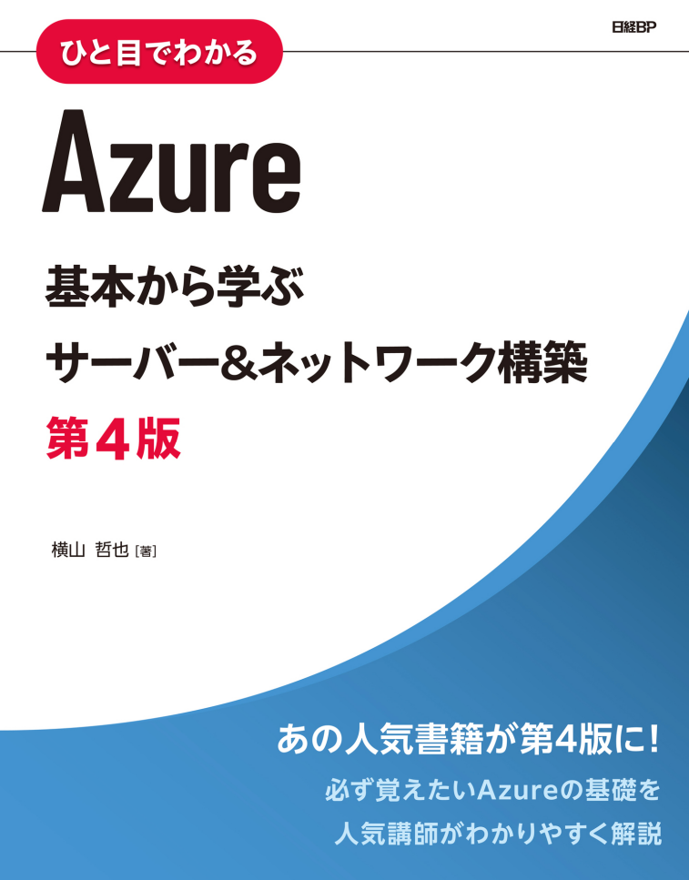

# クラウド開発 Ⅰ

:::info このドキュメントについて
このドキュメントは『Azure　基本から学ぶ サーバー&ネットワーク構築 第4版』の実習内容を授業用にまとめたものです。

内容は随時更新されます。

:::

:::warning 404 エラーが出る場合

教材ページを開いた際に 404 エラーが出る場合は、 F5 キーなどでページを再読み込みしてください

:::

## 第 1 章 Azureの概要

- [Azureの概要](/1/Azureの概要.md)

## 第 2 章 仮想マシンを作ってみよう

- [仮想マシンを作ってみよう](/2/仮想マシンを作ってみよう)

